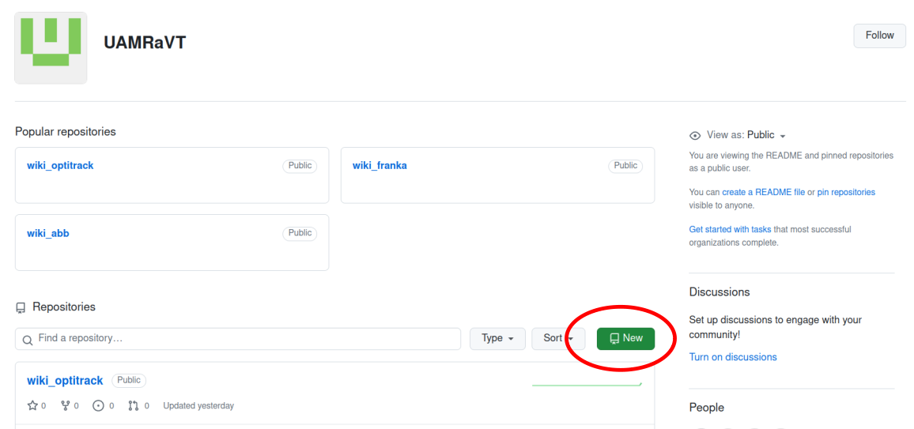
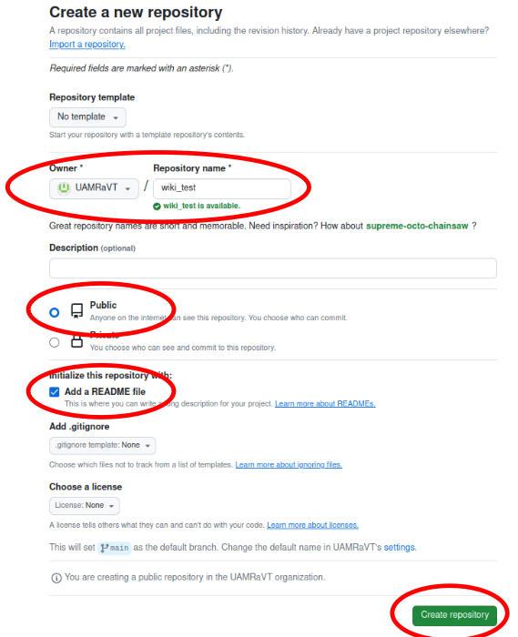
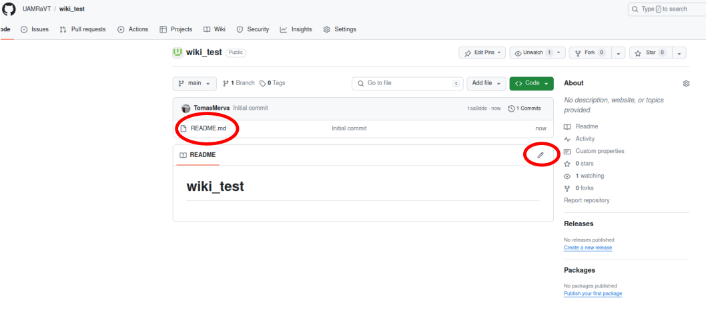
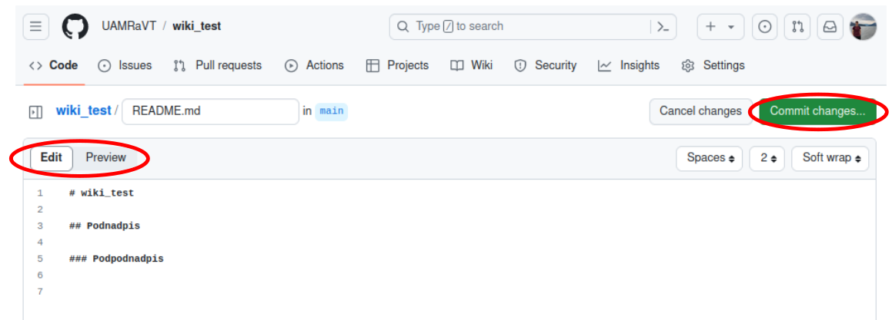
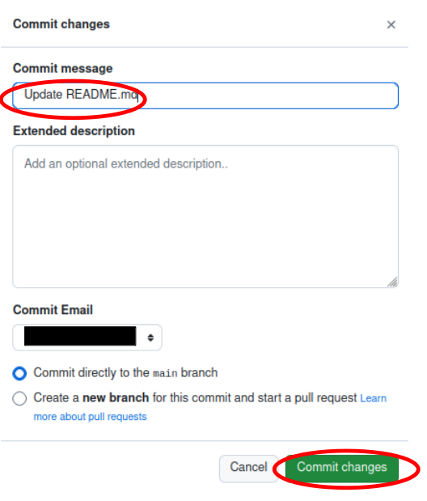
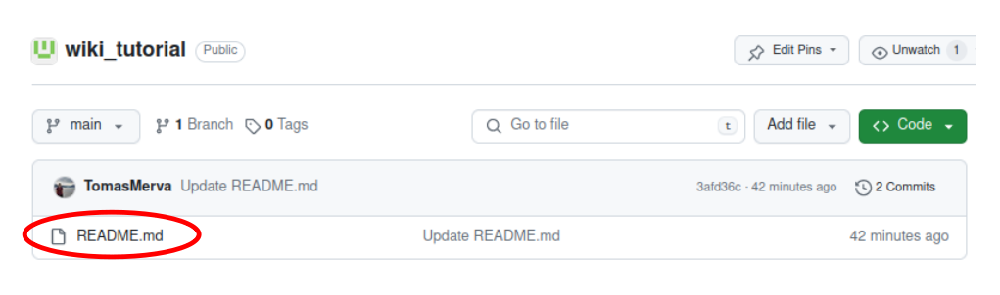
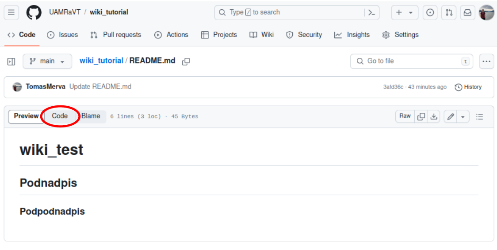

# wiki_tutorial

## Table of Contents
- [Uvod](#úvod)
- [Tvorba nového návodu](#tvorba-nového-návodu)
  - [Vytvorenie repozitáru](#vytvorenie-repozitáru)
  - [Editovanie návodu](#editovanie-návodu)
- [Syntax](#syntax)

## Úvod
Github je platforma pre správu verzií a hosting softvérových projektov. Umožňuje vývojárom spolupracovať na projektoch, sledovať zmeny v kóde a udržiavať históriu týchto zmien. Je to základný nástroj pre väčšinu moderných softvérových vývojárov na zdieľanie a spoluprácu na kóde. V našom prípade to budeme používať pre ukladanie tutoriálov k používaniu hardvéru.

## Tvorba nového návodu
### Vytvorenie repozitáru
Ako prvé je potrebné si vytvoriť nový repozitár, čo je miesto pre uchovávanie a spravovanie kódu. V našom prípade to bude služíť na uchovávanie návodov. Pre vytvorenie nového repozitáru, kliknite na tlačidlo `New` v pravom hornom rohu obrazovky.



Následne sa otvorí nové okno, kde je potrebné nastaviť názov tutoriálu / repozitáru. Taktiež musíte nastaviť viditeľnosť repozítáru na verejnú (Public) a zaškrtnite možnosť `Add a README file`. V tomto súbore budeme písať návod a teda potrebujeme, aby nám ho Github automaticky vygeneroval. Na záver klikneme na tlačidlo `Create repository`.



### Editovanie návodu
`README.md` je jednoduchý textový súbor, ktorý môže obsahovať formátovaný text pomocou značiek ako Markdown. Môžte v ňom písať popis projektu, inštrukcie na inštaláciu alebo použitie, príklady kódu a ďalšie informácie, ktoré chcete zdieľať s ostatnými. Editovať súbor `README.md` vieme robiť priamo vo webovom prehliadači. 




Je nutné si uvedomiť, že `README.md` vyžaduje používanie istého syntaxu, podobne ako LaTeX. V ľavom hornom rohu, je možné si prepínať medzi editovacím a ukážkovým módom (`Preview`). V editovacom móde pišete tutoriál a v ukážkovom je možné si skontrolovať, ako to bude vyzerať po uložení. Po dopísani návodu, prípadne po urobení zmeny, je nutné uložiť danú zmenu pomocou tlačidla `Commit changes` v pravom hornom rohu.




Následne sa Vám otvorí nové okno, kde je nutné napísať správu v časti `Commit message`, ktorá popisuje danú zmenu. V princípe, tam môže byť napísané hocičo, ale musí tam byť aspoň nejaký popis. Je to pomôcka pre Vás, aby ste si spätne vedeli pozrieť ake zmeny sa urobili. Ak chcete napísať podrobnejší popis zmeny, ktorú chcete urobiť, môžte použiť textové okno `Extended description`.



## Syntax
Pre vkladanie kódu používajte nasledovný formát.
``` bash
    sudo systemctl stop ros.service
```

Keď si chcete pozriet, ako je napísaný nejaký `README.md` súbor po syntaxovej stránke, kliknite na súbor `README.md` v tabuľke.



Následne v pravom hornom rohu kliknite na tlačidlo `Code`




>[!Important]
> V rámci týchto repozitárov je možné nahrať aj PDF, kódy, prezentácie... V podstate akýkoľvek súbor, ale treba mať na pamäti, že nemáme neobmedzenú veľkosť úložiska, a preto tu nezdieľajte veľké súbory.

